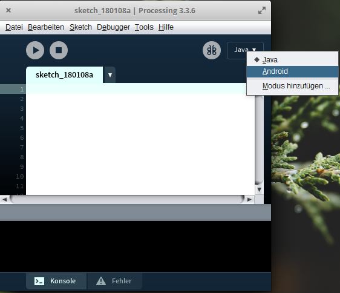

# Einleitung
Hallo Programmier-StarterIn! In diesem Tutorial lernst du mit meiner Hilfe das Programmieren. Wir entwickeln zusammen ein Spiel, dass du auf dem Desktop oder auf einem Android Smartphone spielen kannst. Hierbei werde ich Lösungen für Probleme vorschlagen oder Beispiele geben. Es liegt an dir, wie genau du diese umsetzen willst. Sei kreativ! Du kannst dem Spiel einen ganz eigenen Charakter geben.

# Zusammenfassung
In diesem Level geht es um die Einrichtung der Entwicklungsumgebung und das Installieren der benötigten Komponenten.

| Thema                 | Voraussetzungen         |
| --------------------- | ----------------------- |
| Schwierigkeit         | :star:                  |
| Hardware              | PC (Windows/Mac/Linux)  |
| Software              | Browser, Internetzugang |
| CatcherTutorial Level | %                       |
| Programmierung        | %                       |

## Java installieren
Für die Ausführung der Entwicklungsumgebung und das Programmieren benötigst du Java. Falls dies noch nicht auf deinem PC installiert ist, gehe auf die [Oracle Webseite](http://www.oracle.com/technetwork/java/javase/downloads/jdk8-downloads-2133151.html), lade das *Java SE Development Kit* herunter und installiere es. Wähle für dein Betriebssystem das richtige Paket (Windows bei dir wahrscheinlich: *Windows x64*, Mac: *macOS*, Linux: *Linux x64*).

## Processing installieren
Processing ist eine kostenlose Entwicklungsumgebung. Gehe auf die [Processing Webseite](https://processing.org/download/), lade dir die Version für dein Betriebssystem herunter (Windows bei dir wahrscheinlich: *Windows 64-bit*, Mac: *Mac OS X*, Linux: *Linux 64-bit*) und packe das Paket an einem Ort deiner Wahl aus. Installiere oder starte Processing.

## Processing Android
Im Laufe des Tutorials wird die Anwendung nicht nur auf dem Desktop ausgeführt. Du wirst das Spiel auch auf einem Android Smartphone ausführen können. Hierzu muss der Android Modus in Processing aktiviert werden.
#### 1.Schritt

#### 2.Schritt

#### 3.Schritt

#### 4.Schritt
Nachdem du das erste mal den Android Modus startest, wirst du nach dem Android-SDK gefragt. Das SDK wird für das Kompilieren der Android-App benötigt. Wenn du noch kein Android-SDK auf dem PC hast kannst du dieses direkt herunterladen.

 
